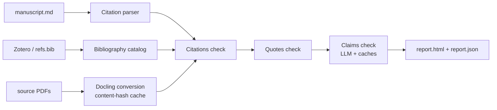

<div align="center">

# citefact

**Do your sources actually say what you claim?**

[](LICENSE)
[](https://www.python.org)
[](https://docs.astral.sh/uv/)

[Quickstart](#-quickstart) · [How It Works](#%EF%B8%8F-how-it-works) · [Usage](#-usage) · [Limitations](#%EF%B8%8F-limitations)


<sub>A fabricated quote caught with the source's own words. <a href="https://raw.githubusercontent.com/hearthresearch/citefact/main/docs/images/report-full.png">Full report</a>.</sub>

</div>

---

LLMs made it trivial to produce manuscripts with fabricated citations, altered quotes, and claims the cited sources never made. Existing tools check that citations *exist*; **citefact reads the full text of every cited source and checks that it *supports what you wrote*** — then hands you a report with the evidence, before a reviewer finds it first.

## 🚀 Quickstart

```bash
# From a Zotero collection (Zotero 7+ running; no export needed):
uvx citefact check manuscript.md --zotero-collection "PhD/Chapter 3"

# Or from a BibTeX file and a folder of PDFs:
uvx citefact check manuscript.md --bib refs.bib --pdfs ./papers/
```

That's the whole setup: `uvx` fetches citefact, the report lands in `./citefact-report/report.html`. The citation and quote checks are free and need no API key. The claims check uses an LLM with your own key — run `uvx citefact setup` once and it configures everything interactively, or pass `--skip-claims` to stay entirely keyless and offline.

## 🧭 Three Checks, Cheapest First

| Check | Question it answers | Method | Cost |
|---|---|---|---|
| **1 · Citations** | Does every in-text citation exist in the bibliography, with a source document? | Deterministic | Free |
| **2 · Quotes** | Is every direct quote really verbatim in its cited source? | Deterministic (normalized + fuzzy) | Free |
| **3 · Claims** | Does the source actually support the claim attached to it? | LLM, with verbatim evidence per verdict | ~cents per source |

| | Citation-existence checkers | citefact |
|---|---|---|
| Citation exists in bibliography | ✅ | ✅ |
| Direct quotes verbatim in source | ❌ | ✅ |
| Source actually supports the claim | ❌ | ✅ |
| Works offline / keyless | varies | ✅ (checks 1+2) |
| Metadata / DOI linting | ✅ | ❌ (other tools do this well) |

Every claim verdict (`supported` / `partial` / `misrepresented` / `not_in_paper`) carries a verbatim evidence quote, reasoning, and a confidence score. It is presented as an AI suggestion, never as ground truth: **citefact reports, you decide.**

## ✨ Why researchers keep it in the loop

- 📚 **Zotero-native** - point it at a collection and it reads metadata and attached PDFs through Zotero's local API; no exports, no Better BibTeX
- 🔒 **Keyless mode** - `--skip-claims` catches fabricated citations and altered quotes with zero network calls
- 🤖 **Your LLM, your key** - Anthropic, OpenAI, or fully local via Ollama, all through [LiteLLM](https://docs.litellm.ai/)
- 📊 **One-file report** - self-contained HTML (no CDN, no requests), with every citation's status, word-level diffs for altered quotes, and one-click links to the manuscript and each source PDF
- ⚡ **Cached everything** - PDF conversions, claim extraction, and verdicts are content-addressed; editing one paragraph re-verifies only what changed, and an unchanged re-run costs $0 in seconds
- 🕵️ **Private by construction** - no telemetry; the only writes are the cache and the report, and the only network traffic is your LLM provider

## ⚙️ How It Works



1. **Parse** - a deterministic parser extracts every in-text citation (narrative, parenthetical, multi-author lists, multi-citation groups) and resolves it against the bibliography by first-author surname + year.
2. **Convert** - source PDFs become text via [Docling](https://github.com/docling-project/docling), cached by content hash.
3. **Check** - citations and quotes are verified deterministically; claims are extracted verbatim and judged per (claim, source) pair by the LLM, evidence included.
4. **Report** - a filterable single-file `report.html` plus a versioned `report.json` for CI.

## 📖 Usage

| Command | What it does |
|---|---|
| `citefact check MANUSCRIPT` | Run the audit and write the report |
| `citefact setup` | Interactive first-run: pre-download Docling, configure and validate your LLM key |
| `citefact doctor` | Show what is installed and missing, per feature |
| `citefact convert --pdfs DIR` | Pre-convert PDFs to warm the cache |

### CI gating

```bash
citefact check manuscript.md --bib refs.bib --pdfs ./papers/ --skip-claims --fail-on error
```

Exit codes: `0` clean, `1` findings at or above `--fail-on` (default `error`), `2` execution error. Errors are the serious findings (fabricated citations, altered or unfound quotes, `misrepresented`/`not_in_paper` verdicts); `--fail-on warning` is stricter, `--fail-on none` just collects the report. Failed LLM calls surface as `unverified` findings and mark the run partial — never silently dropped.

### Live progress

Long phases draw progress bars with ETA and running LLM cost on interactive terminals (plain lines in CI), and every run ends with a summary:

```
Verifying claims ━━━━━━━━━━━━━━╸━━  38/41  0:03:12  ETA 0:00:15  $0.31  smith2023

⚠️ Summary: 0 errors, 13 warnings (quotes 13) | cost $0.33 | 158.2s
Report: citefact-report/report.html
```

<details>
<summary><b><code>check</code> flags reference</b></summary>

| Flag | Default | Meaning |
|---|---|---|
| `--bib FILE` | | BibTeX bibliography (this or `--zotero-collection`) |
| `--zotero-collection NAME` | | Zotero collection (name or `"Parent/Child"` path); needs Zotero 7+ running |
| `--pdfs DIR` | | Folder of source PDFs, fuzzy-matched to entries lacking one |
| `--skip-claims` | off | Citations + quotes only: free, keyless |
| `--only LEVELS` | all | Comma-separated subset: `citations,quotes,claims` |
| `--model` / `--provider` | `anthropic/claude-sonnet-5` | LLM for the claims check |
| `--fail-on` | `error` | `error` \| `warning` \| `none`: what makes the exit code 1 |
| `--out DIR` | `./citefact-report` | Where `report.html` + `report.json` land |
| `--json` | off | Also stream `report.json` to stdout |
| `--quiet` | off | Silence progress and summary |
| `--force` | off | Ignore the conversion cache |

Environment: `CITEFACT_CACHE` relocates the `.citefact/` cache (written next to the manuscript by default); `CITEFACT_MODEL` pins a model. `citefact convert` resolves its cache relative to the current directory, so run it from the manuscript's folder or set `CITEFACT_CACHE`.

</details>

<details>
<summary><b>All finding types</b> (what lands in the report)</summary>

| Finding | Check | Severity | Meaning |
|---|---|---|---|
| `orphan_citation` | citations | error | In-text citation with no bibliography entry (the fabricated-citation signal) |
| `uncited_reference` | citations | warning¹ | Bibliography entry never cited in the text |
| `missing_source` | citations | warning | Entry is cited but no PDF/text is available, so later checks skip it |
| `quote_verified` | quotes | info | Quote found verbatim in the source |
| `quote_modified` | quotes | error | Near match only; the report shows a word-level diff |
| `quote_not_found` | quotes | error | Quote does not appear in the cited source |
| `quote_unattributed` | quotes | warning | Long quote with no resolvable citation nearby |
| `claim_verdict` | claims | by verdict | `supported` info · `partial` warning · `misrepresented`/`not_in_paper` error · `unverified` warning |

¹ Demoted to info with `--zotero-collection`: a collection is a reading library, so uncited entries are normal there.

</details>

## 🤖 LLM Configuration

**The easy path is one command:**

```bash
uvx citefact setup
```

It asks for your provider, takes the API key with hidden input, validates it with a minimal call, and stores it in `~/.config/citefact/config.toml` (owner-only permissions). Done — `citefact check` just works from then on.

Everything else is an override, in precedence order: `--model` / `--provider` flags > `ANTHROPIC_API_KEY`-style environment variables and `CITEFACT_MODEL` > the setup config file > the built-in default (`anthropic/claude-sonnet-5`). Any LiteLLM-supported provider works, including fully local:

```bash
uvx citefact check manuscript.md --bib refs.bib --model ollama/llama3.1
```

## ⚠️ Limitations

- Author-year (APA-like) citation styles only; numeric styles (Vancouver/IEEE) are on the roadmap
- Markdown manuscripts only in v0.1 (DOCX next; the manuscript itself cannot be a PDF)
- You supply the source PDFs; there is no automatic retrieval by DOI
- The first PDF conversion downloads the Docling environment (~1-2 GB, one-time) into the `uv` cache
- Claim verdicts are AI suggestions with the usual LLM failure modes; that is why every verdict carries its evidence

**Roadmap:** DOCX manuscripts → LaTeX (`\cite{}`) → numeric citation styles → stable JSON schema and JOSS submission. `report.json` already carries `schema_version` and is the contract for integrations.

<details>
<summary><b>For developers</b></summary>

```bash
git clone https://github.com/hearthresearch/citefact
cd citefact
uv sync
uv run pytest              # unit tests, LLM mocked
uv run pytest --run-evals  # opt-in LLM eval fixtures (costs money)
```

</details>

## 📄 License

[MIT](LICENSE)

## 🤝 Acknowledgments

- [LiteLLM](https://docs.litellm.ai/) for provider-agnostic LLM access
- [Docling](https://github.com/docling-project/docling) for PDF-to-Markdown conversion
- [ZotSeek](https://github.com/introfini/ZotSeek) - related tool: AI-powered semantic search for Zotero

---

*citefact: Do your sources actually say what you claim? Built by José Fernandes*
